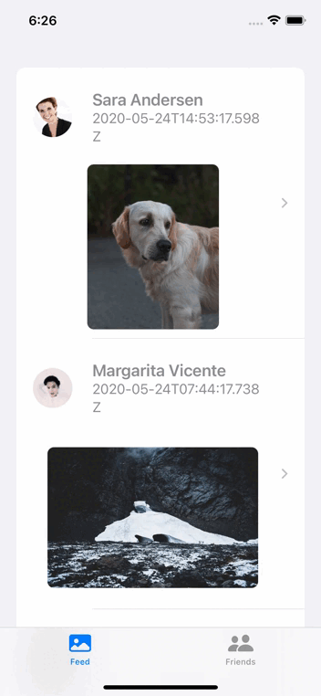

# Kotlin Multiplatform Mobile with Jetpack Compose and SwiftUI

This is a starting point for **KMM (Kotlin Multiplatform Mobile)** projects designed with **Clean Arquitecture** and **MVI (Model View Intent)**, intended to be understable, testable and scalable. This project is preconfigured with essentials libraries and tools, as well as modules, interfaces, base classes, unit and integration tests, just ready for you to start your Android and iOS app. We make use of https://dummyapi.io/ to fetch the data from a RESTful API.

* Kotlin Multiplatform
* MVI (Model View Intent)
* UI layer: Jetpack Compose (Android) and SwiftUI (iOS)

## Android:

## iOS:
